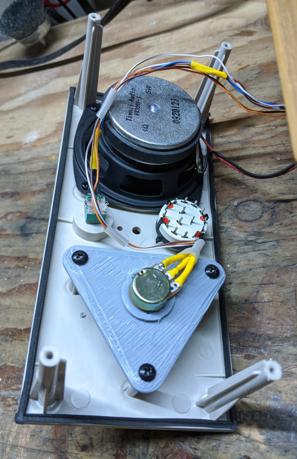

# Simple Internet Radio Photo Gallery

Tivoli Audio Model One guts replacement, March 2020

Exterior photo showing paper dial pasted over tuning scale.

Interior: Rear Panel

Exterior: Rear Panel

 

Interior: Front Panel

3D printed mount for Pot interfacing with tuning dial. 

 

Original Analog Boards removed

Wiring Diagram

